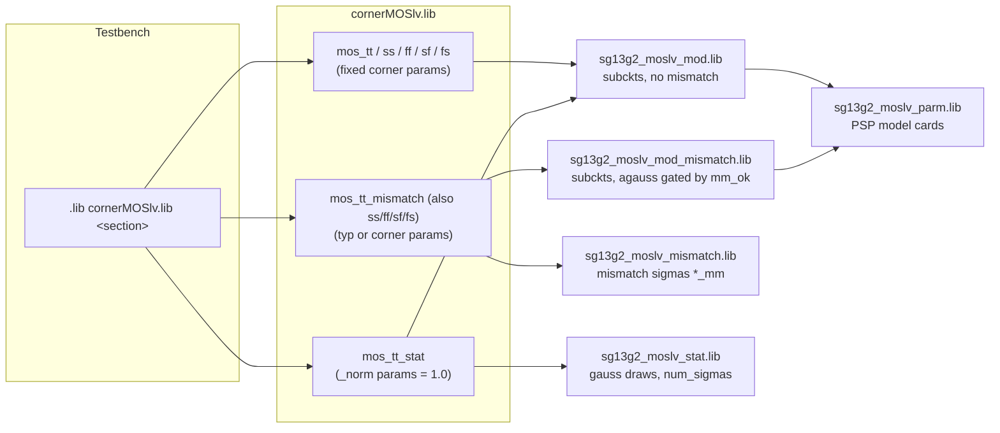

# SG13CMOS5L ngspice Models: Corner, Monte Carlo and Mismatch Simulation Guide

**Scope:** `ihp-sg13cmos5l/libs.tech/ngspice/models/` of the IHP Open PDK, state of August 2026 (`ihp-sg13cmos5l @ ff32f48`, the PDK shipped in the IIC-OSIC-TOOLS 2026.08 image).
This guide explains how the model files fit together, what the `mm_ok` and `num_sigmas` (formerly `mc_ok`) parameters do, and which statistical simulations are possible with which devices.

It is the SG13CMOS5L edition of the guide that ships with the [SG13G2 sibling of this template](https://github.com/iic-jku/ihp-sg13g2-ams-chip-template). Read section 2 first: most of this PDK's model files are literally the SG13G2 ones, and knowing which is the fastest way to know what carries over.

---

## 1. Three kinds of variation

The PDK models three different effects. Keeping them apart is the key to understanding the file structure.

| Effect | What it models | Mechanism in the PDK | Scope |
|---|---|---|---|
| **Corners** (tt, ss, ff, sf, fs, typ, bcs, wcs) | Fixed worst/best case process shifts | Fixed `.param` values per library section | All devices of a family together |
| **Global process variation** ("stat", MC) | Lot-to-lot and wafer-to-wafer spread | `gauss()` draws at `.param` level, **one draw per simulation run**, shared by all devices of a type | All devices of a type get the *same* shift |
| **Local mismatch** ("MM") | Device-to-device differences on the same die | `agauss()` draws inside each subcircuit, **one draw per instance**, gated by `mm_ok` | Every instance gets its *own* shift |

Corners are deterministic. Stat and mismatch are random and only make sense inside a Monte Carlo loop, where the netlist is re-evaluated for every run so that new random values are drawn.

---

## 2. Most of this model set is SG13G2

The directory contains 34 files, and **26 of them are symbolic links into `ihp-sg13g2/libs.tech/ngspice/models/`**. The two PDKs share the same 130 nm front end, so the LV MOS, HV MOS, RF MOS, the varactor, the MOS capacitors, the resistors, the ESD devices and the bondpad are not ported models, they are the same files.

| Family | Files | Source |
|---|---|---|
| MOS LV | `cornerMOSlv.lib`, `sg13g2_moslv_{mod,mod_mismatch,parm,stat,mismatch}.lib` | symlink to SG13G2 |
| MOS HV + varactor | `cornerMOShv.lib`, `sg13g2_moshv_{mod,mod_mismatch,parm,stat,mismatch}.lib`, `sg13g2_svaricaphv_mod{,_mismatch}.lib` | symlink to SG13G2 |
| MOS capacitors | `cornerMOSCAP.lib`, `sg13g2_moscap_{mod,mod_mismatch,parm,stat,mismatch}.lib` | symlink to SG13G2 |
| Resistors | `cornerRES.lib`, `resistors_{mod,mod_mismatch,stat}.lib` | symlink to SG13G2 |
| ESD, bondpad | `sg13g2_esd.lib`, `sg13g2_bondpad.lib` | symlink to SG13G2 |
| **MoM capacitors** | `cornerCAP.lib`, `cap_cmomi.lib`, `cap_cmomf.lib` | **SG13CMOS5L** |
| **pnpMPA** | `cornerPNP.lib`, `sg13cmos5l_pnpMPA_{mod,stat}.lib` | **SG13CMOS5L** |
| **Diodes** | `cornerDIO.lib`, `diodes.lib` | **SG13CMOS5L** |

**What this means in practice:** for every symlinked family, the section names, the sigma values, the `mm_ok` gating and the `num_sigmas` mechanism are bit-identical to SG13G2. Anything written for SG13G2 about `mos_tt_mismatch` or `res_stat` is true here without qualification. Only the eight SG13CMOS5L files below need their own explanation.

### What SG13CMOS5L does not have

| Missing here | SG13G2 files that have no counterpart |
|---|---|
| SiGe HBTs | `cornerHBT.lib`, `sg13g2_hbt_{mod,mod_mismatch,stat}.lib` |
| MIM capacitors (`cap_cmim`, `cap_rfcmim`) | `capacitors_{mod,mod_mismatch,stat}.lib` |
| Schottky diode | `sg13g2_dschottky_nbl1_{mod,stat}.lib` |
| Deep-nwell isolation devices | the `isolbox`, `dpwdnw` and `ddnwpsub` subcircuits of SG13G2's `diodes.lib` |

`cornerCAP.lib` exists on both sides but means something different: on SG13G2 it is the MIM capacitor entry point, here it is the MoM capacitor entry point. A testbench ported from SG13G2 keeps working because the section names were kept, but it is now simulating a different device family. There is no MIM capacitor on this process, so `cap_cmim` and `cap_rfcmim` instances have to be replaced, not re-cornered.

### OSDI objects

`libs.tech/ngspice/.spiceinit` loads six OSDI compact models at start-up: `psp103`, `psp103_nqs`, `r3_cmc`, `mosvar`, and the two SG13CMOS5L-only ones, `cap_cmomi` and `cap_cmomf`. If ngspice is started without that `.spiceinit` on its search path, the two MoM capacitors fail to instantiate, and the MOS and resistor models fail the same way.

---

## 3. File overview

The naming follows a pattern with four roles:

* `corner*.lib` - entry points. These are the only files a testbench should reference. Each contains several `.LIB section ... .ENDL` blocks that set parameters and include the right model files.
* `*_mod.lib` - the actual device models (subcircuits and model cards), without mismatch.
* `*_mod_mismatch.lib` - the same device models, with per-instance `agauss()` mismatch terms gated by `mm_ok`.
* `*_stat.lib` - global process variation. Random `gauss()` draws at `.param` level that feed the model cards.
* `*_mismatch.lib` (without `_mod`) - just the mismatch sigma values (`*_mm` parameters), included next to `*_mod_mismatch.lib`.
* `*_parm.lib` - huge PSP parameter cards for the MOS devices, included by both the `_mod` and `_mod_mismatch` flavor.

### Entry points

| File | Origin | Sections |
|---|---|---|
| `cornerMOSlv.lib` | SG13G2 | `mos_tt/ss/ff/sf/fs`, each also as `_mismatch`, plus `mos_tt_stat`. LV MOS. |
| `cornerMOShv.lib` | SG13G2 | Same section names as above. HV MOS plus the `sg13_hv_svaricap` varactor. |
| `cornerMOSCAP.lib` | SG13G2 | `moscap_tt`, `moscap_tt_mismatch`, `moscap_tt_stat`. `sg13_moscap_n` / `sg13_moscap_p`. |
| `cornerRES.lib` | SG13G2 | `res_typ/bcs/wcs`, each also as `_mismatch`, plus `res_stat` and `res_stat_mismatch`. |
| `cornerCAP.lib` | SG13CMOS5L | `cap_typ/bcs/wcs`, `cap_typ/bcs/wcs_mismatch`, `cap_typ_stat`. MoM caps. **All of them load the same nominal models**, see section 6. |
| `cornerPNP.lib` | SG13CMOS5L | `typ`, `stat`, `bcs`, `wcs`. `pnpMPA`. Note the section names carry **no family prefix**. |
| `cornerDIO.lib` | SG13CMOS5L | `dio_tt` only. Antenna diodes and ESD devices, all deterministic. |

### Device model files

| File | Role | Contents |
|---|---|---|
| `sg13g2_moslv_mod.lib` | model | `sg13_lv_nmos`, `sg13_lv_pmos` subcircuits (PSP). Includes `sg13g2_moslv_parm.lib`. |
| `sg13g2_moslv_mod_mismatch.lib` | model + MM | Same subcircuits with `agauss()` on w, l, `delvto`, `factuo`. |
| `sg13g2_moslv_parm.lib` | parameter card | PSP 103 model cards for LV MOS. |
| `sg13g2_moslv_stat.lib` | stat | `gauss()` draws for vfbo, ctl, muew, tox and more. Defines `num_sigmas=1`. |
| `sg13g2_moslv_mismatch.lib` | MM sigmas | `sg13g2_lv_*_delvto_mm`, `factuo_mm`, `dw_mm`, `dl_mm`. |
| `sg13g2_moshv_*.lib`, `sg13g2_moscap_*.lib` | | Same five-file structure for HV MOS and for the MOS capacitors. |
| `sg13g2_svaricaphv_mod{,_mismatch}.lib` | model (+ MM) | `sg13_hv_svaricap` varactor. Sigmas live in `sg13g2_moshv_mismatch.lib`. |
| `resistors_mod.lib` | model | `rsil`, `rppd`, `rhigh` on the r3_cmc model, plus `Rparasitic`. `sw_mman=0`. |
| `resistors_mod_mismatch.lib` | model + MM | Same, with `sw_mman=1` and `mm_ok`-gated `nsmm_*` draws. |
| `resistors_stat.lib` | stat | Global sigma values `drsh_*`, `dw_*`, `dl_*`. |
| `cap_cmomi.lib` | model | 2-terminal wrapper around the `cap_cmomi` OSDI device (interdigitated MoM, full RF equivalent circuit). |
| `cap_cmomf.lib` | model | 2-terminal wrapper around the `cap_cmomf` OSDI device (metal fringe MoM, low-frequency only). |
| `sg13cmos5l_pnpMPA_mod.lib` | model | `pnpMPA` (Gummel-Poon). |
| `sg13cmos5l_pnpMPA_stat.lib` | stat | `gauss()` draws for cje, cjc, is, bf, re, rb, rc. |
| `diodes.lib` | model | `dantenna`, `dpantenna`. No statistics. |
| `sg13g2_esd.lib` | model | `diodevdd_2kv/4kv`, `diodevss_2kv/4kv`. No statistics. |
| `sg13g2_bondpad.lib` | model | Bondpad. No statistics. |

A historical note: the headers of some `_mod.lib` files still say "do not include this file directly, use models.typ, .bcs or .wcs only". Those top level files no longer exist. The `corner*.lib` sections took over that job. The advice itself still holds, always go through a corner section.

---

## 4. How the files link together

Every device family follows the same include pattern. The corner section decides which flavor of the model gets loaded.



The same shape repeats for every family that has the full set:

| Section flavor | MOS LV | MOS HV | MOSCAP | RES | PNP |
|---|---|---|---|---|---|
| plain corner | `sg13g2_moslv_mod.lib` | `sg13g2_moshv_mod.lib` + `sg13g2_svaricaphv_mod.lib` | `sg13g2_moscap_mod.lib` | `resistors_mod.lib` | `sg13cmos5l_pnpMPA_mod.lib` |
| `*_mismatch` | `sg13g2_moslv_mismatch.lib` + `sg13g2_moslv_mod_mismatch.lib` | `sg13g2_moshv_mismatch.lib` + `sg13g2_moshv_mod_mismatch.lib` + `sg13g2_svaricaphv_mod_mismatch.lib` | `sg13g2_moscap_mismatch.lib` + `sg13g2_moscap_mod_mismatch.lib` | `resistors_mod_mismatch.lib` | not available |
| `*_stat` | `sg13g2_moslv_stat.lib` + `sg13g2_moslv_mod.lib` | `sg13g2_moshv_stat.lib` + `sg13g2_moshv_mod.lib` + `sg13g2_svaricaphv_mod.lib` | `sg13g2_moscap_stat.lib` + `sg13g2_moscap_mod.lib` | `resistors_stat.lib` + `resistors_mod.lib` | `sg13cmos5l_pnpMPA_stat.lib` + `sg13cmos5l_pnpMPA_mod.lib` |
| `res_stat_mismatch` | not available | not available | not available | `resistors_stat.lib` + `resistors_mod_mismatch.lib` | not available |

The MOS columns additionally pull in their `*_parm.lib` PSP model cards through the `_mod` and `_mod_mismatch` files.

`cornerDIO.lib` is the simplest of all here: `dio_tt` loads `diodes.lib` and `sg13g2_esd.lib` and that is the whole file. Unlike SG13G2 there is no `dio_tt_stat`, because the only diode with statistical data on SG13G2 is the Schottky, which this process does not have.

`cornerCAP.lib` is a special case and is covered in section 6.

---

## 5. Global process variation and `num_sigmas` (the parameter formerly known as `mc_ok`)

The `*_stat.lib` files implement global process variation. The pattern, from `sg13g2_moslv_stat.lib`:

```spice
.param num_sigmas=1
.param mc_sg13g2_lv_nmos_vfbo = 'gauss(sg13g2_lv_nmos_vfbo_norm, 0.0050, num_sigmas)'
.param sg13g2_lv_nmos_vfbo    = mc_sg13g2_lv_nmos_vfbo
```

The corner section sets `sg13g2_lv_nmos_vfbo_norm = 1.0`, the stat file draws a random value around it, and the PSP model card in `sg13g2_moslv_parm.lib` multiplies it in (`vfbo = '-0.94312*sg13g2_lv_nmos_vfbo'`). Because the draw happens in a `.param` statement, it is evaluated once per netlist load. All LV NMOS devices in the circuit see the same `vfbo` in a given Monte Carlo run. That is exactly what global process variation means.

`sg13cmos5l_pnpMPA_stat.lib` uses the same pattern with its own seven parameters (`sgp_mpa_cje` 1.5 %, `cjc` 0.7 %, `is` 4.3 %, `bf` 7.9 %, `re` 1.6 %, `rb` 0.8 %, `rc` 1.7 %, all one-sigma).

The stated sigma values are one-sigma deviations (one third of the min-max corner span, as noted in the file headers).

### What happened to `mc_ok`

`mc_ok` was the original name of the third `gauss()` argument in the stat files, used as a global on/off switch (`.param mc_ok=1`). In May 2025 it was renamed to `num_sigmas` in all ngspice stat files (commit `f0e3d00b`, "introduce num_sigmas instead mc_ok for statistical models"). Same position, same default of 1, but the name now reflects what the argument really is: it tells ngspice at how many sigmas the given deviation is specified.

In short: **`mc_ok` no longer exists in the ngspice models.** It still appears in three places:

1. The **Xyce** model files (`libs.tech/xyce/models/*_stat.lib`) were never renamed and still use `mc_ok`.
2. Some of the xschem test schematics under `libs.tech/xschem/tests/` still contain a leftover `.param mc_ok=1`, `mc_lv_nmos_cs_loop.sch` among them. Against the current ngspice models this line defines an unused parameter and has no effect.
3. Git history.

A practical consequence of the mechanism: a third argument of 0 disables the random draw and `gauss()` returns the nominal value. The mismatch gating described next relies on exactly this behavior.

---

## 6. Local mismatch and `mm_ok`

The `*_mod_mismatch.lib` files add device-to-device variation. Every random term sits inside the subcircuit, so each instance draws its own value, and every term carries the same gate:

```spice
(mm_ok != 1 ? 0 : 1)
```

as the third `agauss()` argument. With `mm_ok=1` the draw is active, with anything else it collapses to the nominal value. `mm_ok` is a parameter of each device subcircuit, so it can be set per instance in the schematic.

### What actually varies per family

| Family | Mismatched quantities | Sigma source |
|---|---|---|
| MOS (LV and HV, incl. RF) | w, l, threshold shift `delvto`, gain factor `factuo` | `sg13g2_mos*_mismatch.lib`. The `delvto`/`factuo` sigmas scale with `1/sqrt(m*l*w)`, the Pelgrom area law. Larger devices mismatch less. |
| `sg13_moscap_n` / `sg13_moscap_p` | same four quantities as the MOS devices | `sg13g2_moscap_mismatch.lib` (`delvto_mm` 3.9 mV n / 2.2 mV p, `factuo_mm` 0.5 % n / 0.33 % p, `dw_mm` 4 nm, `dl_mm` 2 nm) |
| Resistors rsil, rppd, rhigh | sheet resistance, w, l via the r3_cmc `nsmm_*` inputs, `sw_mman=1` | Section parameters `rsh_*_mm`, `dw_*_mm`, `dl_*_mm` |
| `sg13_hv_svaricap` | w, l | `sg13g2_moshv_mismatch.lib` |
| `cap_cmomi`, `cap_cmomf` | **nothing.** `mm_ok` is accepted for interface parity and is a no-op | no mismatch model exists |
| `pnpMPA`, diodes, ESD, bondpad | nothing | no mismatch model exists |

### The MoM capacitors have no spread at all

This is the one place where a SG13G2 habit gives a wrong answer on SG13CMOS5L, and the PDK's own file headers say so in as many words.

`cap_cmomi` and `cap_cmomf` have **no characterised process-corner and no characterised mismatch data**. Every section of `cornerCAP.lib` (`cap_typ`, `cap_bcs`, `cap_wcs` and their `_mismatch` variants, plus `cap_typ_stat`) includes the same two nominal model files. The section names exist so that a corner sweep written against SG13G2 resolves unchanged, not because the corners differ.

Two further caveats from the same headers, worth knowing before quoting a number:

- `cap_cmomi` carries the SG13G2 density coefficients transferred to the Metal1..Metal4 stack **by layer count** `N = mmax - mmin + 1`. `N = 3` and `N = 4` are transferred from SG13G2 measurements, `N = 2` is extrapolated. Its low-frequency capacitance is the trustworthy quantity. The RF branches are lumped fits valid to about 50 GHz, and with the default `feed=double` a large device (around 30 x 30 µm) self-resonates inside that band.
- `cap_cmomf` capacitance comes from the Magic device generator (`libs.tech/magic/ihp-sg13cmos5l-cap.tcl`), recalibrated against a 3D OpenEMS analysis. It is simulation-derived, not foundry silicon data. It has no series R/L and therefore never self-resonates, so its RF behaviour is optimistic. Extract the layout if you need parasitics.

Treat every corner, MC and mismatch result for these two devices as the nominal value, and budget capacitor spread by hand until IHP publishes silicon data.

### Where `mm_ok` comes from and what the defaults are

`mm_ok` as an instance parameter was introduced on the xschem side in two steps. PR [#991](https://github.com/IHP-GmbH/IHP-Open-PDK/pull/991) added it to `sg13_lv_nmos` and `sg13_lv_pmos`. PR [#993](https://github.com/IHP-GmbH/IHP-Open-PDK/pull/993) (merged May 28, 2026) rolled the same convention out to all remaining primitive symbols. Of the families that exist here that is HV MOS, RF MOS, the resistors, svaricap and the MOS caps, and the rest of the PR covered the SG13G2-only HBT and MIM devices. Each symbol got `mm_ok=@mm_ok` in its netlisting `format` string and a default in its `template` string. The LVS format string was deliberately left untouched, because `mm_ok` is a simulation knob and not a physical property. It must never show up in an LVS netlist.

The SG13CMOS5L primitive library inherits all of this directly: of the 33 symbols in `libs.tech/xschem/sg13cmos5l_pr/`, **30 are symlinks into `sg13g2_pr`**, and only `cap_cmomi.sym`, `cap_cmomf.sym` and `gallery.sym` are SG13CMOS5L files. The `mm_ok` defaults are therefore exactly the SG13G2 ones:

| Level | Default | Meaning |
|---|---|---|
| xschem symbol (`template` attribute) | **`mm_ok=1`** | Every device netlisted from xschem has mismatch enabled |
| ngspice subcircuit (`.param` / subckt line) | **`mm_ok=0`** | A netlist that does not pass `mm_ok` gets deterministic devices |
| Qucs-S symbols | `mm_ok=1` (hidden) | Same convention as xschem |

There is also a `sg13g2_pr` entry in `libs.tech/xschem/` that is a symlink to `sg13cmos5l_pr`, so a schematic saved against the SG13G2 symbol paths still resolves its symbols after switching `$PDK`.

### What about schematics created before PR #993?

Instances placed before the PR carry no `mm_ok` attribute in the `.sch` file. This is not a problem. When xschem netlists an instance, any `@param` token in the symbol's format string that the instance does not define falls back to the value in the symbol's `template` attribute. Since the installed PDK symbols now say `mm_ok=1`, old schematics netlist with `mm_ok=1` exactly like new ones. The default is applied in the background.

Two situations where this fallback does **not** save you:

* The schematic uses **local copies** of the PDK symbols made before the PR. Those templates have no `mm_ok`, the netlist then contains no `mm_ok`, and the subcircuit default of 0 switches mismatch off without any warning.
* The netlist is written **by hand** or generated by another tool and omits `mm_ok`. Same result, mismatch is silently off.

If a mismatch Monte Carlo produces suspiciously identical runs, check the netlist for `mm_ok=1` on the instance lines first. The `inverter` macro of this template is a worked example: its four devices carry an explicit `mm_ok=1` in [inverter.sch](../../macros/inverter/schematic/xschem/inverter.sch), so the value is visible in every netlist it produces.

---

## 7. What you can simulate: the full matrix

The corner section chooses the mechanism. `mm_ok` only acts inside `*_mismatch` sections, everywhere else it is accepted and ignored. The stat sections exist only at the typical corner.

### Per-family section overview

| | plain corner | corner + mismatch | typ + stat (global MC) | stat + mismatch |
|---|---|---|---|---|
| **MOS LV** (`cornerMOSlv.lib`) | `mos_tt`, `mos_ss`, `mos_ff`, `mos_sf`, `mos_fs` | all five as `*_mismatch` | `mos_tt_stat` | not available |
| **MOS HV + svaricap** (`cornerMOShv.lib`) | same | same | `mos_tt_stat` | not available |
| **MOS caps** (`cornerMOSCAP.lib`) | `moscap_tt` | `moscap_tt_mismatch` | `moscap_tt_stat` | not available |
| **Resistors** (`cornerRES.lib`) | `res_typ`, `res_bcs`, `res_wcs` | all three as `*_mismatch` | `res_stat` | **`res_stat_mismatch`** |
| **MoM caps** (`cornerCAP.lib`) | `cap_typ`, `cap_bcs`, `cap_wcs` | all three as `*_mismatch` | `cap_typ_stat` | not available |
| **pnpMPA** (`cornerPNP.lib`) | `typ`, `bcs`, `wcs` | not available | `stat` | not available |
| **Diodes, ESD** (`cornerDIO.lib`) | `dio_tt` | not available | not available | not available |

Every `cornerCAP.lib` cell in that row is nominal, see section 6.

### Result matrix

```
MC only (global process variation):
  mos_tt_stat        + (mm_ok irrelevant)   -> all devices shift together, no mismatch
  moscap_tt_stat, res_stat and cornerPNP's "stat" behave the same way

MM only (local mismatch):
  mos_tt_mismatch    + mm_ok=1              -> per-device mismatch around typical
  mos_tt_mismatch    + mm_ok=0              -> nothing varies, identical to mos_tt
  mos_ss_mismatch    + mm_ok=1              -> per-device mismatch around the SS corner
  (same for ff/sf/fs and for the bcs/wcs mismatch sections of RES)

MC and MM combined:
  res_stat_mismatch  + mm_ok=1              -> resistors only. Global draw for all
                                               resistors plus a local draw per instance
  res_stat_mismatch  + mm_ok=0              -> global draw only, equals res_stat

No variation at all, whatever you ask for:
  every cornerCAP.lib section, and cornerDIO.lib
```

Four points worth spelling out:

* **Corner plus mismatch is supported for MOS and RES.** The `_mismatch` flavor exists for every corner of MOS and RES, not just typical. Mismatch around SS or WCS is a normal use case.
* **Global MC exists only at the typical corner.** There is no `mos_ss_stat` or similar. That is by design, the corners themselves already bound the global spread.
* **Stat plus mismatch in one run exists only for resistors** (`res_stat_mismatch`). For MOS and MOSCAP the two mechanisms cannot be combined with the shipped sections, because the stat sections always include the non-mismatch model file. If you need it, you can write your own section following the `res_stat_mismatch` pattern (combine `*_stat.lib`, `*_mismatch.lib` and `*_mod_mismatch.lib`), but that is a user extension and not qualified by IHP.
* **`pnpMPA` has global variation but no mismatch.** There is no `sg13cmos5l_pnpMPA_mod_mismatch.lib`, so a matched pair of `pnpMPA` devices, the classic bandgap topology, cannot be simulated for offset on this PDK.

### Is `mos_tt_mismatch` with `mm_ok=0` the same as `mos_tt`?

Yes, the two are numerically identical. Verified against the current files:

* The fixed parameter blocks of the `mos_tt` and `mos_tt_mismatch` sections in `cornerMOSlv.lib` are line-for-line the same.
* With the draws disabled, the mismatch subcircuit passes `w`, `l`, `delvto=0`, `factuo=1` to the PSP model. The non-mismatch subcircuit in `sg13g2_moslv_mod.lib` passes exactly `delvto=0` and `factuo=1` explicitly.
* Both include the same `sg13g2_moslv_parm.lib` model cards.

The only requirement is that *every* instance has `mm_ok=0`. And since `mm_ok` is unused in the non-mismatch sections, `mos_tt + mm_ok=0` and `mos_tt + mm_ok=1` are trivially the same as well.

The same equivalence holds for the other families. For resistors the disabled `nsmm_*` draws and the `nsig_*=0` parameters of `res_typ_mismatch` reduce it to `res_typ` (the remaining difference, `sw_mman=1` with all mismatch inputs at zero, changes nothing).

---

## 8. Practical usage

### Selecting sections in a testbench

```spice
* corner run
.lib cornerMOSlv.lib mos_tt
.lib cornerRES.lib   res_typ
.lib cornerCAP.lib   cap_typ
.lib cornerPNP.lib   typ

* global process MC
.lib cornerMOSlv.lib mos_tt_stat
.lib cornerRES.lib   res_stat
.lib cornerPNP.lib   stat

* mismatch MC
.lib cornerMOSlv.lib mos_tt_mismatch
.lib cornerRES.lib   res_typ_mismatch
```

Note the missing prefix on the `cornerPNP.lib` sections: it is `.lib cornerPNP.lib typ`, not `pnp_typ`.

The corner block of this template's chip-level testbench, [chip_top_tb_tran.sch](../../testbenches/xschem/chip_top_tb_tran.sch), is

```spice
.lib cornerMOSlv.lib mos_tt
.lib cornerMOShv.lib mos_tt
.lib cornerRES.lib   res_typ
.lib ../models/cornerDIO_custom.lib dio_tt
```

Compared with the SG13G2 template it drops the `cornerHBT.lib hbt_typ` and `cornerCAP.lib cap_typ` lines, because neither family exists here in the SG13G2 sense. `cornerDIO_custom.lib` is a project-local deck in [testbenches/xschem/models/](../../testbenches/xschem/models/) that mirrors the PDK's `cornerDIO.lib` but swaps in convergence-tuned antenna diode models. It loads `sg13g2_esd.lib` unchanged from the PDK. For the same reason the inverter macro's CACE datasheet parameterises `corner_mos` and `corner_r` and has no capacitor corner.

Random values are redrawn when the circuit is re-parsed. A typical ngspice control loop therefore reloads or resets between runs. The PDK ships working examples in `libs.tech/xschem/tests/`:

| Schematic | What it shows |
|---|---|
| `mc_lv_nmos_cs_loop.sch`, `mc_lv_pmos_cs_loop.sch` | LV MOS Monte Carlo control loop |
| `mc_hv_nmos_cs_loop.sch`, `mc_hv_pmos_cs_loop.sch` | the same for the HV devices |
| `mc_res_op.sch` | resistor Monte Carlo |
| `ac_cap_cmomi.sch`, `ac_cap_cmomf.sch` | the two MoM capacitors in AC |
| `dc_pnpMPA.sch` | `pnpMPA` DC sweep |

All but the last three are symlinks into `ihp-sg13g2/libs.tech/xschem/sg13g2_tests_xyce/`, which is why they behave exactly like the SG13G2 examples, leftover `mc_ok` line included.

### Controlling mismatch per device

In xschem, select the instance, press `q` and set `mm_ok=0` or `mm_ok=1`. The classic application is offset analysis: leave `mm_ok=1` on the input pair of a comparator and set `mm_ok=0` on current mirrors, loads and bias devices to see how much of the offset the pair itself contributes. Devices keep their defaults (`mm_ok=1`) unless you override them.

### Pitfalls

* **The MoM capacitors do not vary.** Every `cornerCAP.lib` section is nominal. A Monte Carlo that sweeps a capacitor-defined bandwidth or gain will report zero spread and look like a converged design. Section 6.
* **`cornerPNP.lib` section names have no prefix.** `typ`, `stat`, `bcs`, `wcs`. Writing `pnp_typ` by analogy with the other families gives a "section not found" error.
* **`res_typ_stat` does not exist.** The resistor stat sections are named `res_stat` and `res_stat_mismatch`, without `typ`, unlike every other family. `tests/mc_res_op.sch` still references `res_typ_stat`, which matches no section in `cornerRES.lib`.
* **`num_sigmas` is defined inside the stat files** with a default of 1. If you want to change it, make sure your `.param num_sigmas=...` actually takes effect after the library include, and verify with a listing before trusting the results.
* **Old symbol copies and hand netlists** fall back to the subcircuit default `mm_ok=0`, see section 6.
* **A missing `.spiceinit`** costs you the OSDI models. PSP MOS, r3_cmc resistors and both MoM capacitors are all OSDI devices here.
* **Xyce is not in sync with ngspice.** The Xyce stat files still use `mc_ok`, the Xyce resistor subcircuits still default to `mm_ok=1`, and the MOS/CAP Xyce models do not accept `mm_ok` on the instance line at all. The two MoM capacitors have no Xyce, gnucap or Qucs-S build at all: their Verilog-A is compiled for ngspice only. This guide applies to ngspice.
* **No mismatch for pnpMPA, diodes, ESD, bondpad and the MoM caps.** Setting `mm_ok` there does nothing, and for global variation only `pnpMPA` has stat data.

---

## 9. Quick reference

| Parameter | Lives in | Default | Purpose |
|---|---|---|---|
| `mm_ok` | every device subcircuit (instance parameter) | 1 in xschem/Qucs-S symbols, 0 in the ngspice subckt definition | Enables the local mismatch draws of *this instance*. Only effective in `*_mismatch` sections, and a no-op on `cap_cmomi` / `cap_cmomf`. |
| `num_sigmas` | `*_stat.lib` files (global parameter) | 1 | Sigma interpretation of the global `gauss()` draws. Replaced `mc_ok` in May 2025. |
| `mc_ok` | removed from ngspice models | was 1 | Old name of `num_sigmas`. Still present in Xyce models and some test schematics. |

Related pull requests: [#991](https://github.com/IHP-GmbH/IHP-Open-PDK/pull/991) (mm_ok on LV MOS symbols), [#993](https://github.com/IHP-GmbH/IHP-Open-PDK/pull/993) (mm_ok on all remaining primitive symbols, subckt defaults to 0, symbol defaults to 1).
